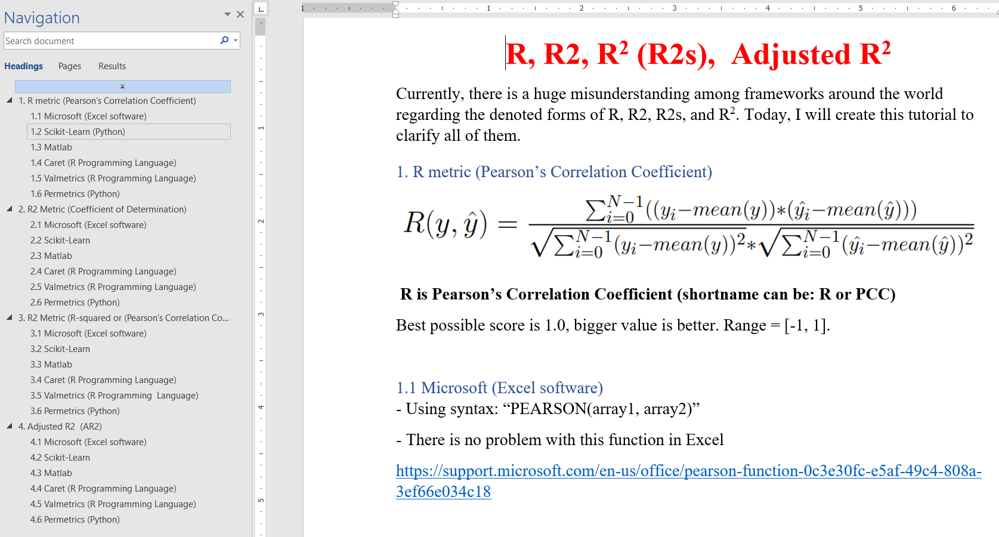

<p align="center"></p>


[](https://github.com/thieu1995/permetrics/releases)
[](https://pypi.python.org/pypi/permetrics) 
[](https://badge.fury.io/py/permetrics)


[](https://pepy.tech/project/permetrics)

[](https://permetrics.readthedocs.io/en/latest/?badge=latest)
[](http://isitmaintained.com/project/thieu1995/permetrics "Percentage of issues still open")
[](https://zenodo.org/badge/latestdoi/280617738)
[](https://opensource.org/licenses/Apache-2.0)


PerMetrics is a python library for performance metrics of machine learning models. We aim to implement all performance metrics for problems such as regression, classification, clustering, ... problems. Helping users in all field access metrics as fast as possible

* **Free software:** Apache License, Version 2.0
* **Total metrics**: 68 (47 regression metrics, 11 classification metrics)
* **Documentation:** https://permetrics.readthedocs.io/en/latest/
* **Python versions:** 3.6.x, 3.7.x, 3.8.x, 3.9.x, 3.10.x
* **Dependencies:** numpy


# Notification

* **Currently, there is a huge misunderstanding among frameworks around the world about the notation of R, R2, and R^2.** 
* Please read the file [R-R2-Rsquared.docx](https://github.com/thieu1995/permetrics/blob/master/R-R2-Rsquared.docx) to understand the differences between them and why there is such confusion.

<p align="center"></p>

* **My recommendation is to denote the Coefficient of Determination as COD or R2, while the squared Pearson's 
  Correlation Coefficient should be denoted as R^2 or RSQ (as in Excel software).**


# Installation

### Install with pip
Install the [current PyPI release](https://pypi.python.org/pypi/permetrics):
```sh 
$ pip install permetrics==1.3.2
```

Or install the development version from GitHub:

```bash
pip install git+https://github.com/thieu1995/permetrics
```

### Install from source
In case you want to install directly from the source code, use:
```sh 
$ git clone https://github.com/thieu1995/permetrics.git
$ cd permetrics
$ python setup.py install
```


# Usage

After installation, you can import Permetrics as any other Python module:

```sh
$ python
>>> import permetrics
>>> permetrics.__version__
```

**Let's go through some examples. The more complicated test case in the folder: examples**

The [documentation](https://permetrics.readthedocs.io/) includes more detailed installation instructions and explanations.


### Example with Regression metrics


```python
from numpy import array
from permetrics.regression import RegressionMetric

## For 1-D array
y_true = array([3, -0.5, 2, 7])
y_pred = array([2.5, 0.0, 2, 8])

evaluator = RegressionMetric(y_true, y_pred, decimal=5)
print(evaluator.RMSE())
print(evaluator.MSE())

## For > 1-D array
y_true = array([[0.5, 1], [-1, 1], [7, -6]])
y_pred = array([[0, 2], [-1, 2], [8, -5]])

evaluator = RegressionMetric(y_true, y_pred, decimal=5)
print(evaluator.RMSE(multi_output="raw_values", decimal=5))
print(evaluator.MAE(multi_output="raw_values", decimal=5))
```


### Example with Classification metrics

```python
from numpy import array
from permetrics.classification import ClassificationMetric

## For integer labels or categorical labels
y_true = [0, 1, 0, 0, 1, 0]
y_pred = [0, 1, 0, 0, 0, 1]

# y_true = ["cat", "ant", "cat", "cat", "ant", "bird", "bird", "bird"]
# y_pred = ["ant", "ant", "cat", "cat", "ant", "cat", "bird", "ant"]

evaluator = ClassificationMetric(y_true, y_pred, decimal=5)

## Call specific function inside object, each function has 3 names like below

print(evaluator.f1_score())
print(evaluator.F1S(average="micro"))
print(evaluator.f1s(average="macro"))
print(evaluator.f1s(average="weighted"))

```

### Get helps (questions, problems)

* Official source code repo: https://github.com/thieu1995/permetrics
* Official document: https://permetrics.readthedocs.io/
* Download releases: https://pypi.org/project/permetrics/
* Issue tracker: https://github.com/thieu1995/permetrics/issues
* Notable changes log: https://github.com/thieu1995/permetrics/blob/master/ChangeLog.md

* This project also related to our another projects which are "meta-heuristics" and "neural-network", check it here 
    * https://github.com/thieu1995/mealpy
    * https://github.com/thieu1995/opfunu
    * https://github.com/thieu1995/metaheuristics
    * https://github.com/aiir-team
  
**Want to have an instant assistant? Join our telegram community at [link](https://t.me/+fRVCJGuGJg1mNDg1)**
We share lots of information, questions, and answers there. You will get more support and knowledge there.

### Cite Us

If you are using mealpy in your project, we would appreciate citations:

```code 
@software{thieu_nguyen_2020_3951205,
  author       = {Nguyen Van Thieu},
  title        = {Permetrics: A framework of performance metrics for artificial intelligence models},
  month        = jul,
  year         = 2020,
  publisher    = {Zenodo},
  doi          = {10.5281/zenodo.3951205},
  url          = {https://doi.org/10.5281/zenodo.3951205}
}
```

### Metrics


| **Problem** | **STT** | **Metric** | **Metric Fullname** |                 **Characteristics**                 |
|:---:|:--:|:----------:|:---:|:---------------------------------------------------:|
| **Regression** | 1 |    EVS     | Explained Variance Score |   Greater is better (Best = 1), Range=(-inf, 1.0]   |
| **** | 2 |     ME     | Max Error |    Smaller is better (Best = 0), Range=[0, +inf)    |
| **** | 3 |    MBE     | Mean Bias Error |            Best = 0, Range=(-inf, +inf)             |
| **** | 4 |    MAE     | Mean Absolute Error |    Smaller is better (Best = 0), Range=[0, +inf)    |
| **** | 5 |    MSE     | Mean Squared Error |    Smaller is better (Best = 0), Range=[0, +inf)    |
| **** | 6 |    RMSE    | Root Mean Squared Error |    Smaller is better (Best = 0), Range=[0, +inf)    |
| **** | 7 |    MSLE    | Mean Squared Log Error |    Smaller is better (Best = 0), Range=[0, +inf)    |
| **** | 8 |   MedAE    | Median Absolute Error |    Smaller is better (Best = 0), Range=[0, +inf)    |
| **** | 9 | MRE / MRB  | Mean Relative Error / Mean Relative Bias |    Smaller is better (Best = 0), Range=[0, +inf)    |
| **** | 10 |    MPE     | Mean Percentage Error |            Best = 0, Range=(-inf, +inf)             |
| **** | 11 |    MAPE    | Mean Absolute Percentage Error |    Smaller is better (Best = 0), Range=[0, +inf)    |
| **** | 12 |   SMAPE    | Symmetric Mean Absolute Percentage Error |     Smaller is better (Best = 0), Range=[0, 1]      |
| **** | 13 |   MAAPE    | Mean Arctangent Absolute Percentage Error |    Smaller is better (Best = 0), Range=[0, +inf)    |
| **** | 14 |    MASE    | Mean Absolute Scaled Error |    Smaller is better (Best = 0), Range=[0, +inf)    |
| **** | 15 |    NSE     | Nash-Sutcliffe Efficiency Coefficient |    Greater is better (Best = 1), Range=(-inf, 1]    |
| **** | 16 |    NNSE    | Normalized Nash-Sutcliffe Efficiency Coefficient |     Greater is better (Best = 1), Range=[0, 1]      |
| **** | 17 |     WI     | Willmott Index |     Greater is better (Best = 1), Range=[0, 1]      |
| **** | 18 |  R / PCC   | Pearson’s Correlation Coefficient |     Greater is better (Best = 1), Range=[-1, 1]     |
| **** | 19 | AR / APCC  | Absolute Pearson's Correlation Coefficient |     Greater is better (Best = 1), Range=[-1, 1]     |
| **** | 20 |    R2s     | (Pearson’s Correlation Index) ^ 2 |     Greater is better (Best = 1), Range=[0, 1]      |
| **** | 21 |  R2 / COD  | Coefficient of Determination |    Greater is better (Best = 1), Range=(-inf, 1]    |
| **** | 22 | AR2 / ACOD | Adjusted Coefficient of Determination |    Greater is better (Best = 1), Range=(-inf, 1]    |
| **** | 23 |     CI     | Confidence Index |    Greater is better (Best = 1), Range=(-inf, 1]    |
| **** | 24 |    DRV     |  Deviation of Runoff Volume |   Smaller is better (Best = 1.0), Range=[1, +inf)   |
| **** | 25 |    KGE     | Kling-Gupta Efficiency |    Greater is better (Best = 1), Range=(-inf, 1]    |
| **** | 26 |    GINI    | Gini Coefficient |    Smaller is better (Best = 0), Range=[0, +inf)    |
| **** | 27 | GINI_WIKI  | Gini Coefficient on Wikipage |    Smaller is better (Best = 0), Range=[0, +inf)    |
| **** | 28 |    PCD     | Prediction of Change in Direction |    Greater is better (Best = 1.0), Range=[0, 1]     |
| **** | 29 |     CE     | Cross Entropy |    Range(-inf, 0], Can't give comment about this    |
| **** | 30 |    KLD     | Kullback Leibler Divergence |            Best = 0, Range=(-inf, +inf)             |
| **** | 31 |    JSD     | Jensen Shannon Divergence |    Smaller is better (Best = 0), Range=[0, +inf)    |
| **** | 32 |    VAF     | Variance Accounted For | Greater is better (Best = 100%), Range=(-inf, 100%] |
| **** | 33 |    RAE     | Relative Absolute Error |    Smaller is better (Best = 0), Range=[0, +inf)    |
| **** | 34 |    A10     | A10 Index |     Greater is better (Best = 1), Range=[0, 1]      |
| **** | 35 |    A20     | A20 Index |     Greater is better (Best = 1), Range=[0, 1]      |
| **** | 36 |    A30     | A30 Index |     Greater is better (Best = 1), Range=[0, 1]      |
| **** | 37 |   NRMSE    | Normalized Root Mean Square Error |    Smaller is better (Best = 0), Range=[0, +inf)    |
| **** | 38 |    RSE     | Residual Standard Error |    Smaller is better (Best = 0), Range=[0, +inf)    |
| **** | 39 |  RE / RB   | Relative Error / Relative Bias |            Best = 0, Range=(-inf, +inf)             |
| **** | 40 |     AE     | Absolute Error |            Best = 0, Range=(-inf, +inf)             |
| **** | 41 |     SE     |  Squared Error |    Smaller is better (Best = 0), Range=[0, +inf)    |
| **** | 42 |    SLE     | Squared Log Error |    Smaller is better (Best = 0), Range=[0, +inf)    |
| **** | 43 |    COV     | Covariance |    Greater is better (No best value), Range=(-inf, +inf)    |
| **** | 44 |    COR     | Correlation |    Greater is better (Best = 1), Range=[-1, +1]     |
| **** | 45 |    EC      | Efficiency Coefficient |  Greater is better (Best = 1), Range=(-inf, +1]    |
| **** | 46 |    OI      | Overall Index  |    Greater is better (Best = 1), Range=(-inf, +1]    |
| **** | 47 |  CRM       | Coefficient of Residual Mass |   Smaller is better (Best = 0), Range=(-inf, +inf)  |
| **** | 48 |         |       |             |
| **Classification** | 1 |     PS     | Precision Score |     Higher is better (Best = 1), Range = [0, 1]     |
| **** | 2 |    NPV     | Negative Predictive Value |     Higher is better (Best = 1), Range = [0, 1]     |
| **** | 3 |     RS     | Recall Score |     Higher is better (Best = 1), Range = [0, 1]     |
| **** | 4 |     AS     | Accuracy Score |     Higher is better (Best = 1), Range = [0, 1]     |
| **** | 5 |    F1S     | F1 Score |     Higher is better (Best = 1), Range = [0, 1]     |
| **** | 6 |    F2S     | F2 Score |     Higher is better (Best = 1), Range = [0, 1]     |
| **** | 7 |    FBS     | F-Beta Score |     Higher is better (Best = 1), Range = [0, 1]     |
| **** | 8 |     SS     | Specificity Score |     Higher is better (Best = 1), Range = [0, 1]     |
| **** | 9 |    MCC     | Matthews Correlation Coefficient |    Higher is better (Best = 1), Range = [-1, +1]    |
| **** | 10 |     HL     | Hamming Loss |     Higher is better (Best = 1), Range = [0, 1]     |
| **** | 11 |     LS     | Lift Score |  Higher is better (Best = +inf), Range = [0, +inf)  |
| **** | 12 |


# Future works

### Classification

+ Calibration Error
+ Cohen Kappa
+ Coverage Error
+ Dice Score
+ Hinge Loss
+ Jaccard Index


### Clustering
+ Adjusted Mutual Information
+ Adjusted Rand Score
+ Calinski And Harabasz Score
+ Davies-bouldin Score
+ Completeness Score
+ Contingency Matrix
+ Silhouette Coefficient
+ V-measure Score


