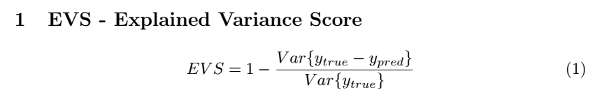

MAE
===

.. toctree::
   :maxdepth: 2
   :caption: MAE - Mean Square Error

+ Best possible score is 1.0, lower values are worse.

Latex code:

.. math::

    EVS = 1 - \frac{Var\{ y_{true} - y_{pred} \}}{Var \{ y_{true} \} }

